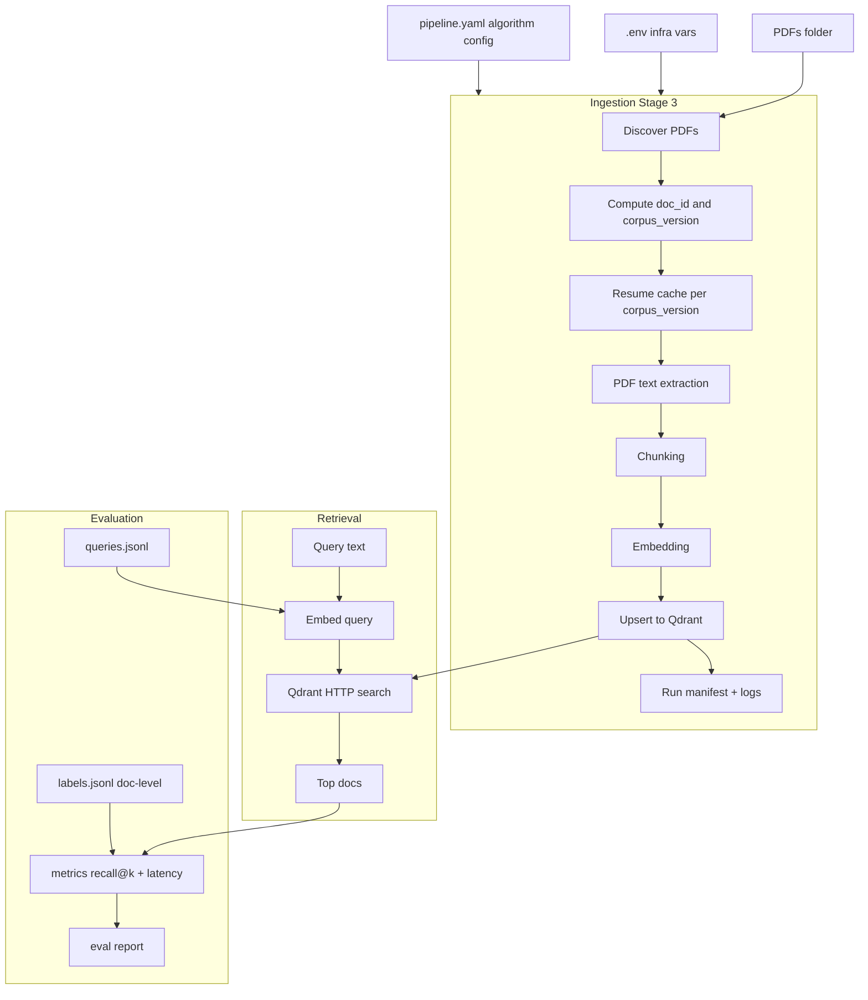

```mermaid
flowchart TD
  A[PDFs folder]
  B[.env infra vars]
  C[pipeline.yaml algorithm config]

  subgraph INGESTION[Ingestion Stage 3]
    D[Discover PDFs]
    E[Compute doc_id and corpus_version]
    F[Resume cache per corpus_version]
    G[PDF text extraction]
    H[Chunking]
    I[Embedding]
    J[Upsert to Qdrant]
    K[Run manifest + logs]
  end

  subgraph RETRIEVAL[Retrieval]
    Q[Query text]
    R[Embed query]
    S[Qdrant HTTP search]
    U[Top docs]
  end

  subgraph EVAL[Evaluation]
    V[queries.jsonl]
    W[labels.jsonl doc-level]
    X[metrics recall@k + latency]
    Y[eval report]
  end

  A --> D --> E --> F --> G --> H --> I --> J --> K
  B --> INGESTION
  C --> INGESTION

  Q --> R --> S --> U
  J --> S

  V --> R
  U --> X
  W --> X --> Y
```
